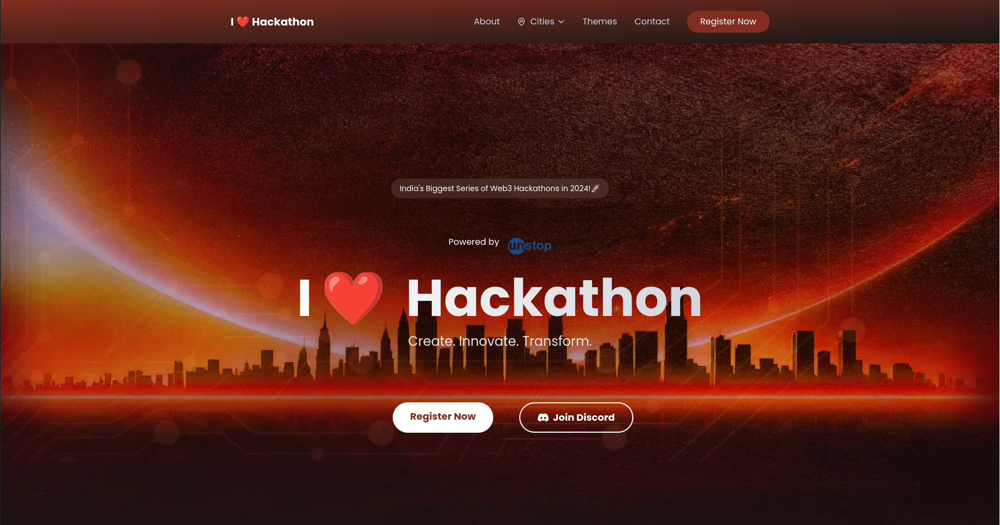
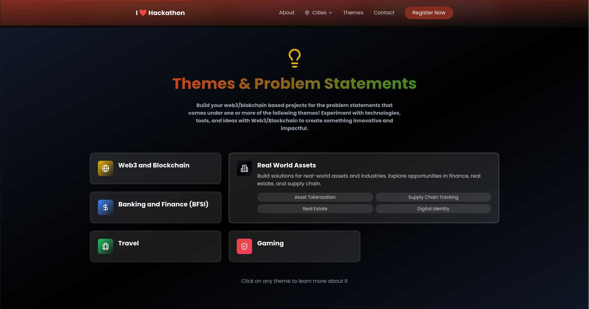
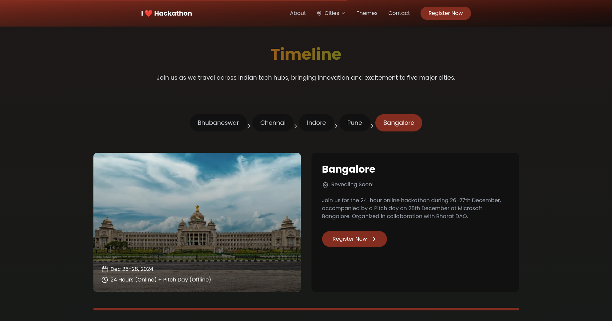
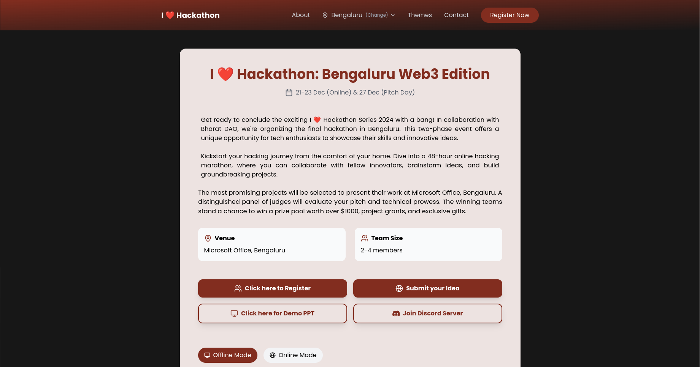

# I Love Hackathon

Welcome to the **I Love Hackathon** project! This repository is dedicated to building an open-source community hackathon website. Our goal is to create a platform where developers, designers, and enthusiasts can collaborate, innovate, and showcase their skills.

## Features

- **Event Management**: Create and manage hackathon events.
- **Team Collaboration**: Form teams and work together on projects.
- **Project Showcase**: Display and share your hackathon projects.
- **Community Engagement**: Connect with other participants and mentors.

## Preview

|  |  |
|------------------------|--------------------------|
|  |  |

## Getting Started

To get a local copy up and running, follow these simple steps.

### Prerequisites

- Node.js
- npm

### Installation

1. Clone the repo
    ```sh
    git clone https://github.com/your-username/I-love-Hackathon.git
    ```
2. Install NPM packages
    ```sh
    npm install
    ```
3. Start the development server
    ```sh
    npm start
    ```

## Contributing

Contributions are what make the open-source community such an amazing place to learn, inspire, and create. Any contributions you make are **greatly appreciated**.

1. Fork the Project
2. Create your Feature Branch (`git checkout -b feature/AmazingFeature`)
3. Commit your Changes (`git commit -m 'Add some AmazingFeature'`)
4. Push to the Branch (`git push origin feature/AmazingFeature`)
5. Open a Pull Request

